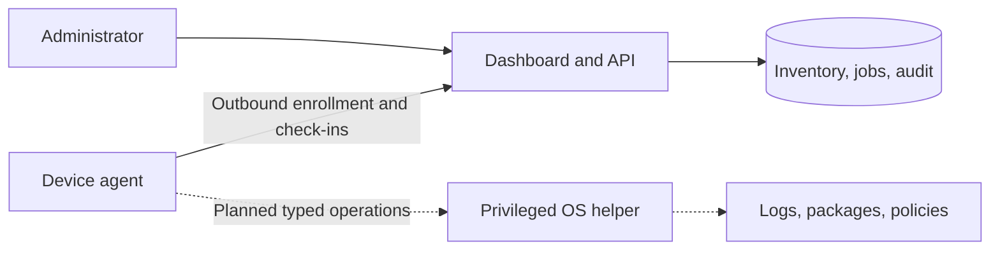

# Architecture

Protec has three eventual components: an authenticated management dashboard and API, an outbound device agent, and OS-specific privileged execution helpers. The current implementation covers the local dashboard/API and foreground inventory agent.

Enrollment requires possession of a short-lived one-device token. The server exchanges it for a unique device credential. The agent sends OS identity and privilege level on each heartbeat. Administrator requests enter a job queue; the authenticated agent only receives jobs assigned to its device. Inventory refresh is the only implemented job kind. A successful authenticated completion closes the job, while a two-minute lease permits redelivery if a response is lost.

The existing design is deliberately narrow enough to test the full path before privileged operations are introduced. Inventory refresh has no side effects and can be retried. Patch installation, reboot, policy changes, and interactive sessions need their own operation semantics, approval rules, and recovery behavior. They must not inherit this simple lease-and-retry implementation without an operation-specific idempotency design.

## Privileged execution design

Use an unprivileged network-facing agent and a small root-owned helper with an explicit operation allowlist. Authorize individual operations with a device binding, job ID, expiry, policy version, and signature. Persist execution receipts locally before sending results. Avoid a generic root shell as the default management interface. Installation and service ownership require a deliberate administrator action on each managed host.

Remote access should use existing SSH implementations with host-key verification, short-lived identity-bound credentials, limited destination scope, and audited session lifecycle. Interactive remote support and unattended administrative automation need separately defined authorization. Desktop access follows after SSH; it requires additional OS permissions and user-consent policy.

## Platform direction

Linux first: Ubuntu/Debian inventory, systemd service health, bounded journal queries, security posture, then APT patch planning and maintenance windows. Extend distribution support through explicit package-manager adapters.

Windows next: signed service installation, protected secrets, event log access, Windows Update integration, and PowerShell operations with constrained permissions.

macOS next: signed/notarized agent, Keychain credentials, launchd service, and native Apple device management integration. A root-installed agent alone is not equivalent to Apple's MDM enrollment and management features.

Reference: [Apple Device Enrollment](https://support.apple.com/guide/deployment/device-enrollment-and-device-management-depd1c27dfe6/web) and [Microsoft Intune enrollment guide](https://learn.microsoft.com/en-us/intune/device-enrollment/guide).
