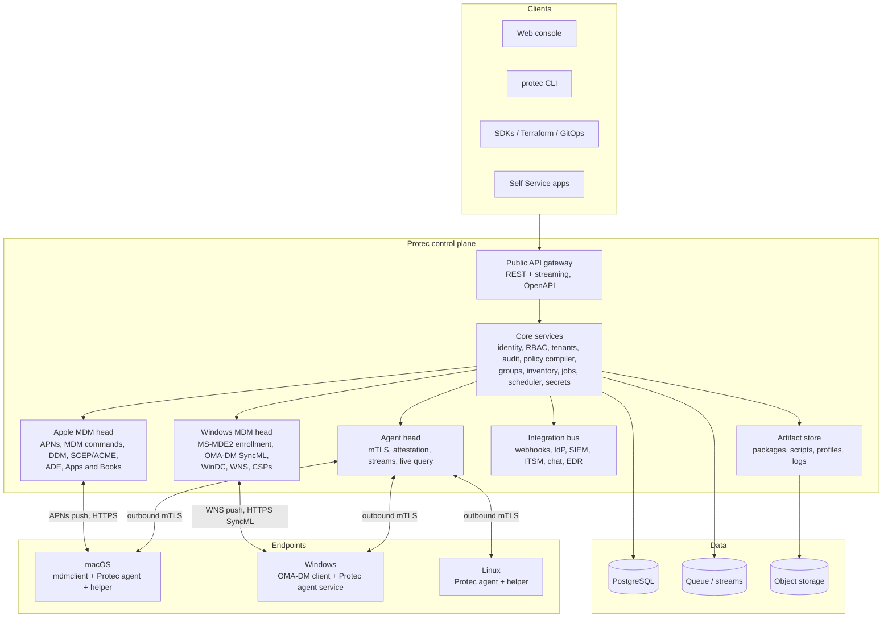

# Protec Platform Program: open-source device management for Linux, macOS and Windows

This is the multi-year program plan for turning Protec into an open-source alternative to Jamf Pro and Microsoft Intune that manages Linux, macOS and Windows endpoints from one control plane. It is deliberately large. It describes the whole product surface an enterprise expects from a unified endpoint management (UEM) platform, the external programs and protocols each operating system requires, the order in which to build it, and the evidence that proves each stage is done.

The existing [delivery roadmap](ROADMAP.md) (M0 through M15) is the 0.x implementation track and stays the source of truth for the next slices of work. This document is the destination that track is heading toward. Appendix A maps every existing milestone into the phases below so nothing already built or planned is lost.

Status verified September 9, 2026: the private portal and matching public demo run the 0.4.0 inventory pilot; 0.5.0 is published with managed rollout pending. Main also contains unreleased execution foundations and scheduling UI. See WORK_SESSION.md for exact source, image, test and deployment evidence. Existing work contributes to several phases below, but does not establish completion of those phases. This document describes the long-term destination: proposed architecture, licensing and external-program choices are not accepted decisions merely because they appear here. No license file is present; licensing remains an explicit decision.

---

## Contents

1. Vision, positioning and principles
2. Reality checks: what Apple, Microsoft and the Linux world gate
3. Target architecture
4. Program structure: horizons, tracks and release gates
5. Phases 0 through 19
6. Parity matrix against Jamf Pro and Microsoft Intune
7. Cross-cutting definitions of done
8. Team shape, sizing and sequencing
9. Risk register
10. Appendix A: mapping the current M0 to M15 milestones
11. Appendix B: external accounts, programs and certificates checklist
12. Appendix C: open-source building blocks to reuse or study
13. Appendix D: glossary

---

## 1. Vision, positioning and principles

### 1.1 Vision

One open-source control plane that enrolls, configures, secures, patches, inventories and supports every laptop, desktop and server an organization owns, whether it runs Linux, macOS or Windows, with the same policy model, the same audit trail and the same operator experience across all three.

### 1.2 Positioning

| | Jamf Pro | Microsoft Intune | Fleet | Protec (target) |
| --- | --- | --- | --- | --- |
| Platforms | Apple only | Windows first, Apple and Linux partial | Cross-platform, osquery-centric | Linux, macOS, Windows as first-class peers |
| Source | Proprietary | Proprietary | Open core | Fully open source, self-hostable, optional hosted |
| Linux depth | None | Ubuntu and RHEL, thin | Inventory strong, management growing | Full management: packages, config, patching, encryption, identity join |
| Native MDM protocols | Apple MDM, DDM | Apple MDM, Windows OMA-DM, WinDC | Apple MDM, Windows OMA-DM | Apple MDM and DDM, Windows OMA-DM and WinDC, plus a universal agent |
| Extensibility | API, webhooks, Marketplace | Graph API, PowerShell | API, GitOps | API, CLI, SDKs, Terraform, GitOps, plugin SDK, MCP server |
| Deployment | SaaS | SaaS | SaaS or self-host | Single binary, Docker Compose, Helm, air-gapped, hosted |

The thesis: the market's two leaders each treat one platform as a second-class citizen and neither treats Linux seriously. Nobody open source covers native Apple and Windows MDM protocols plus deep Linux management in one product. That is the gap.

### 1.3 Principles

1. **Native where native exists, agent where it does not.** Apple and Windows ship MDM protocols; use them for what they do best (enrollment trust, profiles, OS updates, wipe) and use the Protec agent for everything they cannot do (scripts, non-MSI installs, telemetry, Linux). One policy compiles to whichever channel fits.
2. **Desired state, previewed, approved, applied, verified.** Every change flows through five distinct artifacts: the definition, the compiled plan, the dispatched job, the applied state and the collected evidence. The UI never blurs them.
3. **Unknown is a first-class answer.** Missing evidence is reported as unknown, never as compliant or non-compliant.
4. **Least privilege by construction.** Unprivileged network-facing agent, minimal root helper with an operation allowlist, per-operation signatures, short-lived credentials everywhere.
5. **Everything is code.** Policies, groups, apps and baselines are versioned, diffable, exportable and importable. GitOps is a native workflow, not an add-on.
6. **Open by default.** Open protocols, documented APIs, permissive SDK licensing, public roadmap, public security process.
7. **Self-hostable on one box, scalable to a hundred thousand devices.** Same code, different topology.
8. **Never damage the operator's own machine.** Development and CI use disposable targets for anything that mutates a host.

---

## 2. Reality checks: what Apple, Microsoft and the Linux world gate

This section lists the external facts the plan must respect. Ignoring any of them wastes quarters.

### 2.1 Apple

- **MDM push certificate.** Every Apple MDM server needs an APNs MDM push certificate. Customers create it at Apple's Push Certificates Portal by uploading a certificate signing request that has been signed by an MDM vendor certificate. Getting a vendor certificate requires Apple Developer Enterprise Program membership plus approval of the MDM vendor capability. Open-source projects have historically relied on a community CSR-signing service instead. Protec must offer both paths: a Protec-operated CSR signing service once the program is approved, and instructions for the community service until then.
- **Automated Device Enrollment (ADE) and Apple Business Manager (ABM) / Apple School Manager.** Zero-touch enrollment, Apps and Books licensing, Managed Apple Accounts and MDM-to-MDM migration all flow through ABM. The MDM server is registered in ABM by the customer; Protec speaks the device enrollment program (DEP) cloud API and the Apps and Books API. No partner program is required, but the token handling and the API behaviors are exacting.
- **Account-driven enrollment.** Modern user and device enrollment discovers the MDM server through a well-known URL on the organization's domain. Protec must host that discovery document and support the enrollment flows it triggers.
- **Declarative Device Management (DDM).** Apple is moving configuration, software update enforcement, passcode, account, certificate and background task management into declarations with a status channel. New Apple features arrive as DDM first. Protec must be declarative-native, not profile-only.
- **Code signing and notarization.** The macOS agent, its privileged helper, the Self Service app and any installer must be Developer ID signed and notarized. This requires the Apple Developer Program. Unsigned agents will not install on modern macOS.
- **Supervision and Apple silicon.** Recovery Lock, Activation Lock bypass, Bootstrap Token, secure token and volume ownership rules constrain what can be automated. Several capabilities exist only for supervised devices enrolled through ADE.
- **Yearly OS cadence.** A new macOS arrives every September. Day-zero support for new payloads and declarations is a permanent cost, not a one-off.

### 2.2 Microsoft

- **Windows MDM is open.** Windows enrollment (the MS-MDE2 protocol) and management (OMA-DM SyncML, the MS-MDM protocol) are publicly documented and usable by third parties. Configuration service providers (CSPs) expose thousands of settings. This is how Intune manages Windows and it is available to Protec.
- **Declared Configuration (WinDC).** Windows 11 adds a declarative management protocol alongside OMA-DM, with its own enrollment. Protec should support both, as Apple DDM and Windows WinDC are the two vendors' converging direction.
- **Entra ID integration is possible.** A third-party MDM can be registered in Entra ID as an on-premises MDM application with discovery, terms of use and compliance URLs. That enables automatic MDM enrollment when a device joins Entra. This does not require a Microsoft partnership.
- **Windows Autopilot is not available.** Autopilot is a Microsoft service for Intune. Zero-touch for Protec on Windows means provisioning packages during out-of-box experience, Entra join auto-enrollment, imaging integration, or OEM-injected provisioning. This is an honest gap and the plan works around it rather than promising Autopilot.
- **Push notifications require WNS.** Server-initiated sync for Windows MDM uses Windows Push Notification Services, which needs an app registration in Partner Center. Without it Protec falls back to the device's scheduled polling.
- **Non-MSI applications need an agent.** The native CSPs install MSI and MSIX packages. EXE installers, scripts, detection rules and anything Intune does with its Management Extension require the Protec agent on Windows.
- **Windows Server cannot MDM enroll.** Server management is agent-only.
- **Windows LAPS backs up only to Entra or Active Directory.** Protec's local administrator password management on Windows is agent-based with escrow to Protec, the same model used on macOS and Linux.
- **Code signing.** The Windows agent, service and installer must be Authenticode signed with a trusted certificate (for example Azure Trusted Signing or an EV certificate) or SmartScreen and Defender will block or warn.
- **Device compliance for conditional access.** Setting Entra device compliance from a third party requires Microsoft's partner compliance program. The plan delivers conditional access first through Okta, Google Workspace, generic OIDC posture claims and Protec's own device trust, and treats Entra partner compliance as a later partnership outcome.

### 2.3 Linux

- **There is no Linux MDM protocol.** Everything is agent-based. This is an advantage: no external gatekeeper, full control, and Protec can define the best Linux management model in the industry.
- **Fragmentation is the cost.** Distributions differ in package managers (apt, dnf, zypper, pacman, apk, nix), init (systemd nearly everywhere, but not everywhere), desktops (GNOME, KDE Plasma, others), security modules (AppArmor, SELinux), display servers and update models (mutable versus image-based such as Fedora Silverblue and Ubuntu Core). Adapters must be explicit per family and capability, with unknown reported where an adapter is absent.
- **Identity join is a real requirement.** Enterprises want Linux machines joined to Active Directory, FreeIPA or Entra ID with single sign-on at login. SSSD, realmd and the open-source Entra broker Himmelblau are the building blocks.
- **Encryption escrow has no vendor service.** LUKS with TPM2 binding and recovery-key escrow to Protec is the Linux equivalent of FileVault and BitLocker escrow.
- **Repository signing and distribution.** Agent packages must be published in signed apt, dnf and zypper repositories plus Flatpak or Snap where sensible, and as a static binary.

### 2.4 Cross-platform realities

- Mobile platforms (iOS, iPadOS, Android, ChromeOS) share much of the Apple and Windows infrastructure but are explicitly out of scope until Phase 19. The desktop and server fleet is the product.
- The current control plane is Python on the standard library with SQLite. That was right for a pilot. Phase 0 decides the long-term stack before the platform grows around the pilot.

---

## 3. Target architecture

### 3.1 Components

- **Control plane.** A horizontally scalable service with PostgreSQL as the system of record, a queue or stream system for jobs and events, and S3-compatible object storage for large artifacts. Runs as a single binary with embedded migrations for small installs, and as Helm-deployed services for large ones.
- **Protocol heads.** The Apple head and Windows head speak the vendors' MDM protocols and translate Protec's unified policy model into profiles, declarations, commands, SyncML and CSP writes. They are separate deployable services so their certificate and push dependencies stay isolated.
- **Universal agent.** One codebase, three operating systems, a static binary with an OS-specific installer. Outbound-only mTLS with a device identity bound to hardware where possible (Secure Enclave, TPM 2.0). Handles inventory, scripts, application installs the native channel cannot, telemetry, live queries, desired-state enforcement, user notifications and the local Self Service surface.
- **Privileged helper.** A small root or SYSTEM component with an explicit operation allowlist, invoked by the agent through a local authenticated channel. It writes local execution receipts before reporting results. No generic shell as a default.
- **Policy compiler.** Turns a platform-neutral policy definition plus target platform facts into concrete channel operations: an Apple profile or declaration, a Windows CSP set, a Linux desired-state plan, or an agent script. It produces a diff and a plan before anything is dispatched.
- **Evidence pipeline.** Everything the endpoints report is stored with a collection time, a source (attested, agent-reported, MDM-reported) and a freshness state. Compliance is evaluated from evidence and never from intent.

### 3.2 Technology recommendation (decided formally in Phase 0, ADR-001)

Recommend **Go** for the control plane, protocol heads and agent. Reasons: a single static binary per OS for the agent, mature cross-compilation, the strongest open-source ecosystem for exactly this problem (NanoMDM, NanoDEP, KMFDDM, MicroMDM, osquery tooling, Fleet's Windows MDM implementation and mattrax's Windows MDM library are all Go), first-class PostgreSQL and gRPC support, and low operational footprint. TypeScript for the web console. PostgreSQL as the only supported database at scale, with SQLite kept only for the single-box developer mode if it can be maintained without forking logic.

The alternative is to continue in Python (FastAPI plus SQLAlchemy plus a compiled agent in Go or Rust). That preserves the current code but splits the codebase in two languages anyway and loses the ecosystem reuse. The recommendation is to port the 0.3 control plane during Phase 1 while keeping its API behavior and its tests as the acceptance oracle.

---

## 4. Program structure: horizons, tracks and release gates

### 4.1 Horizons

| Horizon | Window | Outcome |
| --- | --- | --- |
| H1: Foundation and enrollment | Months 0 to 12 | All three platforms enroll, inventory, receive apps and basic configuration. Public 1.0 beta. |
| H2: Management parity | Months 12 to 24 | Policy engine, patching, security and compliance, self service, remote operations, integrations. 1.0 GA. |
| H3: Platform leadership | Months 24 to 36 | Scale, conditional access, analytics and AI, marketplace, hosted offering, certifications, mobile. 2.0. |

### 4.2 Parallel tracks

Work runs on six tracks so platform-specific teams are never blocked on one another:

1. **Core platform** (identity, tenancy, policy compiler, jobs, API, console)
2. **Universal agent**
3. **Apple**
4. **Windows**
5. **Linux**
6. **Product operations** (packaging, release engineering, security program, docs, community)

### 4.3 Release gates

- **0.x** (now): pilot. No compatibility guarantees.
- **1.0 beta**: Phases 0 to 7 exit criteria met. Documented upgrade path from beta to GA.
- **1.0 GA**: Phases 8 to 12 exit criteria met, plus the security assurance items in Phase 17 marked GA-blocking, plus 90 days of a public beta with at least three external organizations running production fleets.
- **2.0**: Phases 13 to 18 exit criteria met.

Semantic versioning applies from 1.0. Agent and server maintain N-1 compatibility across minor versions.

---

## 5. Phases

Each phase lists its goal, epics with the concrete features inside them, dependencies, an engineer-month (EM) size range, and exit criteria. Phases within a horizon overlap; the numbering is dependency order, not strict sequence.

---

### Phase 0: Foundations and decisions

**Goal.** Make Protec actually open source, lock the architectural decisions that everything else depends on, and register for every external program with a lead time.

**Depends on.** Nothing. **Size.** 4 to 6 EM.

**0.1 Licensing and governance**
- Choose and add the license. Recommendation: AGPL-3.0 for the control plane, Apache-2.0 for the agent, SDKs, CLI, Terraform provider and any code customers embed. Record the reasoning in ADR-002.
- Contributor terms: Developer Certificate of Origin (DCO) sign-off rather than a CLA.
- Governance document: maintainers, decision process, RFC process for breaking changes, code of conduct, security policy and disclosure process, trademark policy for the Protec name.
- Public roadmap board and public issue tracker; this document becomes the live roadmap.

**0.2 Architecture decision records**
- ADR-001 language and stack. ADR-003 database (PostgreSQL primary). ADR-004 queue or stream system. ADR-005 API style (REST plus server-sent events or gRPC streams for agents). ADR-006 monorepo layout. ADR-007 policy model and compiler. ADR-008 agent transport and device identity. ADR-009 multi-tenancy model. ADR-010 secrets and key management.

**0.3 External programs (long lead times, start immediately)**
- Apple Developer Program (signing and notarization).
- Apple Developer Enterprise Program and MDM vendor capability request.
- Apple Business Manager test organization, Apple Developer sandbox tenants.
- Microsoft Partner Center account for WNS app registration; Authenticode signing via Azure Trusted Signing or an EV certificate; Entra ID test tenants.
- Domain, DNS, TLS automation for demo, docs, package repositories and the CSR signing service.
- Test hardware: at least two Apple silicon Macs, two Windows 11 devices (one with TPM attestation), a Windows Server VM, Linux VMs across Debian, Ubuntu LTS, Fedora, RHEL-compatible, openSUSE and Arch, plus an image-based distribution.

**0.4 Engineering system**
- Monorepo with per-component release pipelines. CI matrix: Linux, macOS and Windows runners; integration tests against ephemeral PostgreSQL; virtual machine tests for agent install, upgrade and uninstall on all three operating systems.
- Reproducible builds, SBOM generation, Sigstore signing of every artifact, provenance attestations.
- Conventional commits, changelog automation, release notes, docs site pipeline.

**Exit criteria.** License file merged. Governance and security policy published. All ADRs accepted. External program applications submitted and tracked with expected dates. CI runs the three-OS matrix on every merge to main.

---

### Phase 1: Core control plane

**Goal.** The durable multi-tenant foundation every other feature plugs into: identity, authorization, tenancy, audit, jobs, events, secrets, API and console shell.

**Depends on.** Phase 0. **Size.** 24 to 32 EM.

**1.1 Identity and access**
- Local accounts with mandatory MFA (TOTP, WebAuthn passkeys).
- Single sign-on via OpenID Connect and SAML 2.0 (Entra ID, Okta, Google Workspace, Keycloak, Authentik tested).
- SCIM 2.0 provisioning of users and groups from the IdP.
- Role-based access control with built-in roles (viewer, help desk, operator, security administrator, application administrator, tenant administrator, global administrator) and custom roles composed from fine-grained permissions.
- Attribute-based scoping: any role can be limited to device groups, sites, platforms or tenants.
- Service accounts and API tokens with expiry, rotation with overlap windows, IP allowlists and scoped permissions. Break-glass local administrator with mandatory audit.
- Session management: device-bound sessions, forced re-authentication for sensitive actions, session revocation.

**1.2 Multi-tenancy and organization model**
- Tenants (fully isolated), sites and departments within a tenant, device ownership (corporate, personal, shared, kiosk), custodians and primary users.
- Cross-tenant administration for managed service providers with per-tenant RBAC.

**1.3 Audit and events**
- Append-only audit log of every administrative action and every device event, with actor, target, before and after, request id and origin.
- Tamper evidence: hash chaining and optional external anchoring; signed export.
- Event bus that every feature publishes to and that webhooks, notifications and integrations consume.
- Retention policies per event class, legal hold.

**1.4 Job and workflow engine**
- Typed, versioned, signed jobs with device binding, expiry, idempotency keys, leases, bounded retries, cancellation and dead-letter handling.
- Approval workflows: single approver, quorum, change windows, emergency override with justification.
- Maintenance windows per device, group, site and time zone.
- Scheduler for recurring work (inventory cadence, compliance evaluation, report generation, certificate renewal).
- Execution receipts stored on device before result upload; server reconciles receipts.

**1.5 Secrets and cryptography**
- Envelope encryption for all secrets at rest with key rotation; pluggable key management (local, cloud KMS, HSM via PKCS#11).
- Escrow store for recovery keys, local administrator passwords and certificates with separate access permission, mandatory reason capture and audit on every reveal.

**1.6 API, CLI and SDKs**
- OpenAPI 3.1 specification as the source of truth; generated clients for Go, Python and TypeScript; a `protec` CLI with the same capabilities as the console.
- Pagination, filtering, sorting and field selection on every list; consistent error model; idempotency headers on writes; rate limiting per principal.
- Webhooks with signing, retries and replay from the event bus.
- Import and export of every configuration object as YAML for GitOps.

**1.7 Console shell**
- Web console with global search, saved views, keyboard navigation, dark and light themes, localization framework, WCAG 2.2 AA accessibility, and a design system shared with the Self Service apps.
- Notification center and activity feed.

**1.8 Data platform**
- PostgreSQL schema with versioned migrations, zero-downtime migration strategy, read replicas, and a documented data model.
- Backup, point-in-time recovery, restore drills automated in CI.

**Exit criteria.** SSO with two IdPs and SCIM verified. Custom roles with scoping enforced server-side and tested for denial. Jobs survive server restart, duplicate delivery and clock skew. Audit export verifiable offline. CLI and console reach feature parity for everything in this phase. 0.3 behaviors reproduced through the new API with the existing test suite as oracle.

---

### Phase 2: Universal agent

**Goal.** One agent for Linux, macOS and Windows that installs cleanly, survives reboots and upgrades, proves its identity, and provides the execution surface the native MDM channels lack.

**Depends on.** Phase 1. **Size.** 20 to 28 EM.

**2.1 Packaging and lifecycle**
- Signed installers: notarized pkg for macOS, MSI for Windows, deb, rpm and a static tarball for Linux, plus signed apt, dnf and zypper repositories.
- Service integration: launchd daemon and agent, Windows service running as SYSTEM plus a per-user helper, systemd system and user units.
- Self-update with staged rollout rings, signature verification, rollback on failed health check, and server-controlled version pinning.
- Clean uninstall that removes credentials and reports the removal.

**2.2 Identity and transport**
- Enrollment by single-use token, by MDM-delivered bootstrap (Apple and Windows MDM install the agent and hand it a credential), or by IdP-authenticated user enrollment.
- Device identity keys generated in Secure Enclave or TPM 2.0 where available, with attestation evidence recorded; software keys with clear labeling otherwise.
- Outbound-only mutual TLS with certificate rotation; long-lived streaming connection for push with polling fallback; proxy and PAC support; offline queue with bounded storage.
- Credential storage in Keychain, Windows DPAPI or Credential Manager, and Linux kernel keyring or encrypted file with TPM sealing where available.

**2.3 Privileged helper and execution**
- Root or SYSTEM helper with an allowlisted operation set, per-operation signature verification, execution receipts and timeouts.
- Script runner for bash, zsh, sh, Python and PowerShell with parameters, secrets injection that never touches disk, output capture with size limits and redaction, exit-code semantics and run-as-user or run-as-system modes.
- File transfer with checksums, resumable downloads from the artifact store and content-addressed caching.
- Local desired-state engine that reconciles assigned state on a cadence and reports drift.

**2.4 Telemetry and inventory collection**
- Built-in collectors for hardware, OS, disk, network, users, security posture, installed software, services, certificates and startup items.
- Embedded osquery-compatible query engine (or osquery itself as an optional extension) for live query and scheduled query packs across all three platforms.
- Health metrics for the agent itself with OpenTelemetry export.

**2.5 User interaction surface**
- Cross-platform notification and dialog framework used by nudges, Self Service, restart prompts, consent requests and onboarding progress.
- Menu bar or tray presence with status and quick actions.

**Exit criteria.** Install, reboot persistence, upgrade, rollback and uninstall verified on every supported OS in automated VM tests. Attestation recorded for Apple silicon and TPM 2.0 devices. A script dispatched with a bad signature, an expired job or the wrong device id is refused with a receipt. Agent memory and CPU budgets published and enforced by tests.

---

### Phase 3: Inventory, groups and search

**Goal.** Know everything about every device, and be able to slice the fleet any way an operator can describe.

**Depends on.** Phase 2. **Size.** 12 to 16 EM.

**3.1 Inventory model**
- Hardware: model, serial, identifiers, CPU, memory, storage, battery health, displays, peripherals, TPM and Secure Enclave state, firmware versions, Secure Boot state.
- Operating system: version, build, kernel, architecture, uptime, last boot, pending reboot, update channel, activation and licensing state.
- Software: applications from every source (native package managers, app stores, Homebrew, winget, Chocolatey, Flatpak, Snap, browser extensions), versions, install dates and publishers.
- Security: disk encryption state and escrow status, firewall, EDR presence, screen lock, password policy result, local administrators, SSH state, remote access services, certificates, secure boot, kernel and system extensions, TCC and privacy grants.
- Network: interfaces, addresses, Wi-Fi SSID, VPN state, DNS, proxies, public IP and geolocation by IP (opt-in).
- Identity: primary user, logged-in users, directory binding, IdP device registration.
- Custom attributes computed by scripts or queries on each platform (Jamf extension attributes and Intune custom compliance equivalents) with typed results.

**3.2 Groups**
- Static groups, dynamic groups from any inventory attribute with boolean logic and set operations, and hybrid groups. Evaluated incrementally on inventory change with membership history.
- Group preview before saving, showing current members and what would change.
- Groups as the universal target for policies, apps, scripts, reports and RBAC scope.

**3.3 Search and views**
- Fleet-wide full-text and structured search with a query language, saved searches, shared views and column customization.
- Device record with timeline, evidence sources and freshness for every field.
- Bulk actions from any list with preview and confirmation.
- Exports to CSV and JSON, and a documented warehouse export.

**Exit criteria.** Inventory matches native tools on a sample of each platform. Dynamic group membership updates within one collection cycle. Custom attributes work on all three platforms. Search returns results under one second on a 50,000-device dataset in the performance suite.

---

### Phase 4: Apple management

**Goal.** Full native macOS management on par with Jamf Pro, built declaratively from the start.

**Depends on.** Phases 1 to 3, Apple programs from Phase 0. **Size.** 36 to 48 EM.

**4.1 Push and certificates**
- APNs MDM push with certificate upload, expiry monitoring and renewal reminders.
- Protec CSR signing service for customers (once the vendor certificate is granted) with the community-signing path documented as the alternative.
- SCEP and ACME certificate authority endpoints for MDM identity; managed device attestation through ACME.

**4.2 Enrollment**
- Automated Device Enrollment through ABM and ASM: server token upload, device sync, profile assignment, Setup Assistant pane control, Managed Apple Account requirements, await-configuration flow with onboarding progress UI, and re-enrollment after erase.
- Account-driven device and user enrollment with the well-known service discovery document and IdP-federated authentication.
- Profile-based enrollment for legacy and lab flows, enrollment customization with branding and consent text.
- MDM-to-MDM migration import: accept devices moving from Jamf, Kandji, Mosyle, Intune or others via ABM migration, and import their groups, profiles and scripts.
- Supervision state tracking and feature gating in the UI based on enrollment type.

**4.3 Configuration**
- Complete configuration profile payload library with a form editor, validation, and raw mobileconfig import and export. Includes restrictions, passcode, Wi-Fi, VPN, certificates, 802.1X, FileVault, firewall, Gatekeeper, login window, dock, energy, printers, PPPC privacy preferences, system extensions, kernel extensions, notifications, content filters, Safari and browser policies, associated domains, Platform SSO, Managed Login Items and background task management.
- Declarative Device Management: declaration authoring, activations, predicates, assets, status subscriptions and status channel ingestion. Software update enforcement, passcode, accounts, certificates, background tasks and Safari extension management delivered as declarations first.
- Automatic channel selection: the compiler prefers declarations where Apple supports them and falls back to profiles or agent scripts.

**4.4 Commands and remote actions**
- Device information queries, security info, installed application list, profile list, certificate list.
- Lock with message and PIN, erase with return-to-service where supported, restart, shutdown, rename, set time zone, Recovery Lock management for Apple silicon, firmware password for Intel, enable and disable remote desktop, rotate FileVault key, unlock user account, set auto-admin password.
- FileVault escrow of personal recovery keys with rotation and audited reveal; Bootstrap Token escrow; Activation Lock bypass code escrow and clearing.
- Software update commands and DDM enforcement with deadlines, deferrals and user nudges.

**4.5 Applications**
- Apps and Books (volume purchasing) integration: token management, license sync, device-based and user-based assignment, app updates, license reclamation.
- Custom pkg deployment through MDM InstallEnterpriseApplication with manifest generation and signing checks.
- Agent-based installs for dmg, zip and scripted installers, using an Installomator-compatible label catalog for hundreds of common titles.
- Homebrew management as an optional channel with formula and cask allowlists.

**4.6 macOS-specific security**
- Local administrator password rotation and escrow (Jamf LAPS equivalent), managed administrator account creation, secure token and volume owner reporting.
- Gatekeeper, XProtect and system integrity state reporting; kernel and system extension allowlisting.
- Compliance baselines generated from the macOS Security Compliance Project (CIS, NIST 800-53, DISA STIG, CMMC) with remediation.

**4.7 Onboarding experience**
- Zero-touch first-boot flow: progress window, ordered installs, account creation choice, device naming rules, department selection, completion state and a summary sent to the operator.

**Exit criteria.** A Mac purchased in ABM goes from box to fully configured with apps, encryption escrowed, compliant baseline and Self Service installed with no operator touch. DDM software update enforcement verified against a deadline. Migration from a Jamf test instance completed without erase. Every payload in the library round-trips through import and export byte-for-byte on the fields Apple defines. Day-zero support process documented and rehearsed on a beta macOS release.

---

### Phase 5: Windows management

**Goal.** Full native Windows management on par with Intune for what Intune does through MDM, plus agent coverage for what Intune does through its Management Extension.

**Depends on.** Phases 1 to 3, Microsoft registrations from Phase 0. **Size.** 36 to 48 EM.

**5.1 Enrollment**
- MS-MDE2 enrollment endpoints: discovery, terms of use, federated authentication through the Protec IdP or an external IdP, certificate issuance through WSTEP, device and user enrollment types.
- Entra ID on-premises MDM application registration and automatic enrollment on Entra join and hybrid join.
- Bulk enrollment through provisioning packages generated by Protec, including OOBE provisioning for near-zero-touch deployment and imaging integration.
- Manual enrollment through Settings, and enrollment through the agent installer for devices that cannot use MDM (Windows Server, Home edition with agent-only management).
- Enrollment restrictions, device limits, and clear reporting of MDM versus agent-only management for each device.

**5.2 Protocol and push**
- OMA-DM SyncML server: session handling, alerts, status codes, atomic commands, node caching and full CSP tree browsing per device.
- WNS push for server-initiated sync with polling schedule management as fallback.
- Declared Configuration (WinDC) enrollment and document delivery with status reporting.

**5.3 Configuration**
- Policy CSP coverage generated from Microsoft's published CSP reference so new settings arrive by regenerating the catalog rather than hand-coding: security, update, Defender, BitLocker, firewall, privacy, browser, Start and taskbar, device restrictions, delivery optimization, kiosk and more.
- ADMX-backed policies and ADMX ingestion for custom templates.
- Settings catalog experience matching Intune's, with search, explanation text and platform applicability.
- Custom OMA-URI for anything outside the catalog.
- Wi-Fi, VPN, certificates through SCEP and PKCS, 802.1X, email and identity protection profiles.
- Group Policy import: parse a GPO backup and map settings to CSP equivalents with a report of unmapped settings.

**5.4 Applications**
- MSI through the desktop application CSP, MSIX and Store apps through the modern application CSP, winget-based installs and updates through the agent, EXE and script installers through the agent with detection rules, requirement rules, return code mapping, dependencies and supersedence.
- Application packaging pipeline using the PowerShell App Deployment Toolkit format for complex installs.
- Microsoft 365 Apps deployment configurations.

**5.5 Updates**
- Windows Update for Business policies: rings, deferrals, deadlines, grace periods, active hours, feature update targeting and pausing, driver updates, delivery optimization.
- Expedited quality updates and reboot orchestration with user notifications.
- Update compliance reporting from device-reported state and a defined data path for Windows Update reports.

**5.6 Windows-specific security**
- BitLocker enforcement and recovery key escrow with audited reveal and rotation.
- Defender Antivirus, attack surface reduction, firewall, exploit protection, application control policies.
- Windows Hello for Business configuration where the device identity supports it.
- Local administrator password rotation and escrow through the agent; local group membership management.
- Security baselines mapped from Microsoft's published baselines and CIS Benchmarks.
- Remote wipe (full, protected, and keep-enrollment variants), remote lock, rename, restart, autopilot-style reset alternative through Protec reset.

**5.7 Windows Server**
- Agent-based management of Windows Server: inventory, scripts, updates through the agent, roles and features reporting, service management, certificate management.

**Exit criteria.** A new Windows 11 device with a Protec provisioning package or Entra auto-enrollment ends configured, encrypted with key escrowed, compliant with a baseline and running required apps with no operator touch. The CSP catalog regenerates from Microsoft's reference without manual edits. A test GPO imports with a mapping report. Windows Server managed through the agent with parity for scripts, inventory and updates.

---

### Phase 6: Linux management

**Goal.** The deepest Linux endpoint management available anywhere, for desktops and servers.

**Depends on.** Phases 1 to 3. **Size.** 30 to 40 EM.

**6.1 Distribution and adapter framework**
- Explicit adapter families: Debian and Ubuntu (apt), Fedora and RHEL family (dnf), openSUSE and SLE (zypper), Arch (pacman), Alpine (apk), NixOS (declarative integration), image-based systems (rpm-ostree, Ubuntu Core snaps). Every capability reports supported, unsupported or unknown per adapter.
- Systemd as the primary service and timer layer with graceful degradation elsewhere.

**6.2 Enrollment and provisioning**
- Agent-based enrollment with token, IdP authentication or cloud-init and kickstart or preseed integration for automatic enrollment at install time.
- Golden image hooks and first-boot provisioning with progress UI on desktops.
- Server enrollment at scale: SSH-based bootstrap from the Protec CLI, Ansible module and Terraform provider for inventory registration.

**6.3 Package and repository management**
- Install, remove, upgrade, pin and hold for every adapter, with dependency preview and transaction receipts.
- Flatpak and Snap management with remote and channel control; AppImage inventory.
- Repository management: add, remove and pin sources, GPG key distribution, and optional mirroring or proxying through Protec for air-gapped fleets.
- Kernel management: version pinning, livepatch status, reboot-required detection.

**6.4 Configuration management**
- Desired-state engine with typed resources: files with templates and permissions, directories, symlinks, users and groups, sudoers rules, systemd units and timers, sysctl, kernel modules, mounts, cron, environment, PAM, NSS, NetworkManager connections, firewalld and nftables rules, SSH daemon configuration, AppArmor and SELinux modes and booleans, journald and logrotate.
- Desktop policies: GNOME dconf lockdown and gsettings, KDE Plasma kiosk restrictions, screen lock and idle policy, login banners, autostart, default applications, printers via CUPS, wallpaper and branding.
- Browser policies for Firefox, Chrome, Chromium and Edge through their enterprise policy files.
- Drift detection and repair with preview and rollback of file content from stored previous state.
- Ansible interoperability: run allowlisted playbooks through the agent and import inventory facts.

**6.5 Identity join**
- Active Directory and FreeIPA join through realmd and SSSD, with offline caching, home directory policy and sudo rules from the directory.
- Entra ID join through Himmelblau with device compliance reporting and Hello-style PIN or passkey login where supported.
- Local user and group management, local administrator password rotation and escrow, SSH key distribution and short-lived SSH certificates.

**6.6 Encryption and firmware**
- LUKS state reporting, TPM2 binding with systemd-cryptenroll, recovery passphrase escrow and rotation, enforcement at provisioning time for new installs.
- Secure Boot state, firmware updates through fwupd and LVFS with staging and reporting.

**6.7 Updates and patching**
- Security and full update policies per adapter with rings, deadlines, maintenance windows, reboot coordination for servers (drain hooks, serial rollout) and desktop nudges.
- Unattended-upgrades and dnf-automatic coordination so native tooling and Protec never fight.
- CVE mapping from distribution security feeds and the OSV database to installed package versions.

**6.8 Security posture and compliance**
- OpenSCAP integration for CIS Benchmark and DISA STIG evaluation and remediation with Protec-native reporting.
- Auditd rules distribution and bounded audit log queries, journald query with redaction, USB and removable media policy through udev rules, firewall posture, listening ports and services.

**6.9 Servers and infrastructure**
- Server-focused views: roles, services, listening ports, certificates expiring, disk pressure, reboot pending, kernel age.
- Container host awareness: Docker and Podman inventory, running images and their vulnerabilities.
- Kubernetes node awareness for inventory only; cluster management is out of scope.

**Exit criteria.** Every adapter family passes the same conformance suite in disposable VMs. A fresh Ubuntu, Fedora and openSUSE desktop reaches a compliant CIS baseline with encryption escrowed and directory join completed automatically. Server patch rollout with serial reboots verified on a ten-node test fleet. Unknown reported correctly on an unsupported distribution.

---

### Phase 7: Application management

**Goal.** One application catalog and deployment model across three operating systems and every native install channel.

**Depends on.** Phases 4 to 6. **Size.** 20 to 28 EM.

**7.1 Unified application model**
- An application record with per-platform install sources, versions, detection rules, requirements, dependencies, supersedence, uninstall commands and assignment intents (required, available in Self Service, uninstall, blocked).
- Assignment to groups with schedules, rings, deadlines and user-versus-device targeting.
- Install status per device with failure reasons and retry policy.

**7.2 Sources and catalogs**
- Curated public catalog of hundreds of common titles with automatic version tracking, built on Installomator labels for macOS, winget and Chocolatey for Windows, and distribution repositories, Flatpak and Snap for Linux.
- Enterprise stores: Apple Apps and Books, Microsoft Store for Business successor flows, and private repositories.
- Custom packages uploaded to the artifact store with malware scanning, signature checks and content-addressed storage.
- Packaging pipelines: AutoPkg recipe runner for macOS, PSADT and MSIX packaging helpers for Windows, deb and rpm build helpers for Linux, all producing signed artifacts with provenance.

**7.3 Patching of third-party applications**
- Vulnerability-aware update catalog: known versions, CVEs, publisher release feeds.
- Auto-update policies with rings, user deferral limits, forced quit handling and relaunch, and success verification.
- Blocklists and version ceilings.

**7.4 Distribution**
- Content delivery through the artifact store with regional caches, peer caching on Windows via delivery optimization and on macOS via content caching awareness, and bandwidth scheduling.

**Exit criteria.** The same application record deploys correctly to all three platforms where the title exists. Detection and supersedence tests pass. A vulnerable third-party version across the fleet is identified and updated by policy within one maintenance window in the test lab. Catalog updates ship at least weekly without a Protec release.

---

### Phase 8: Unified policy and configuration engine

**Goal.** Author a policy once, target any platform, preview exactly what will change, and prove it applied.

**Depends on.** Phases 4 to 7. **Size.** 24 to 32 EM.

**8.1 Policy model**
- Platform-neutral policy types (password, screen lock, encryption, firewall, updates, browser, network, restrictions, login, privacy) with per-platform compilation and explicit unsupported markers.
- Platform-native policy types where no abstraction makes sense (Apple profile payloads, Windows CSPs, Linux resources) sharing the same lifecycle.
- Templates, variables and per-group parameter overrides; secrets referenced, never embedded.

**8.2 Baselines**
- Prebuilt baselines: CIS Benchmarks Level 1 and 2 for macOS, Windows and major Linux distributions; macOS Security Compliance Project profiles; Microsoft security baselines; DISA STIGs; NIST 800-171 and CMMC mappings; ISO 27001 and SOC 2 control mappings.
- Baseline versioning with change reports when a new benchmark version arrives, and exception management with owners and expiry.

**8.3 Assignment, precedence and conflicts**
- Deterministic precedence rules, conflict detection at authoring time, effective policy view per device showing which assignment won and why.
- Staged rollout with rings, canary groups, automatic halt on failure thresholds and one-click rollback to the previous policy version.

**8.4 Preview, plan and evidence**
- Plan view: exact profiles, declarations, CSP writes, files and commands that will be sent, with diffs against current state.
- Post-apply verification from evidence, drift detection cadence, auto-remediation with rate limits, and remediation history.

**8.5 Configuration as code**
- Git repository sync (GitHub, GitLab, Bitbucket, generic) with pull-request previews, plan comments and apply on merge.
- Terraform provider covering every configuration object.
- Full export and import for backup, environment promotion and migration.

**Exit criteria.** A password and encryption policy authored once produces correct native settings on all three platforms with a verified plan. Conflict between two assignments is surfaced before save. A staged rollout halts automatically at the failure threshold in the test suite and rolls back. GitOps loop from pull request to applied policy demonstrated end to end.

---

### Phase 9: Patch and update management

**Goal.** Every operating system and application current within policy, with predictable reboots and clear compliance.

**Depends on.** Phases 4 to 8. **Size.** 14 to 20 EM.

- Unified update policy: rings, deadlines, grace periods, deferral allowances, maintenance windows, quiet hours, and reboot behavior across macOS software updates via DDM, Windows Update for Business, Linux package updates and third-party applications.
- Reboot orchestration: user prompts with countdown and snooze budgets, server drain hooks, serial and percentage-based rollout, forced reboot after deadline, and pending-reboot suppression rules.
- Feature and major upgrade orchestration: macOS major upgrades with storage and compatibility checks, Windows feature updates and edition changes, Linux distribution release upgrades with pre-flight and rollback snapshots where the platform allows.
- Firmware and driver updates: Apple firmware through OS updates, Windows drivers through Windows Update for Business, Linux through fwupd, vendor tools for Dell, Lenovo and HP where they expose command lines.
- Vulnerability correlation: installed versions mapped to CVEs from NVD, OSV, distribution advisories and Apple and Microsoft security release notes; exposure dashboards by severity and exploitability.
- Compliance reporting: per-ring progress, stragglers, failure causes, time-to-patch SLAs and exportable evidence for auditors.

**Exit criteria.** A critical update reaches 95 percent of a mixed test fleet within the ring schedule with no manual intervention. Reboot prompts and forced reboots behave per policy on all platforms. CVE exposure report matches a manual check on a sample.

---

### Phase 10: Security and compliance

**Goal.** Continuous posture, encryption everywhere, certificates without spreadsheets, and device trust that identity providers can consume.

**Depends on.** Phases 4 to 9. **Size.** 28 to 36 EM.

**10.1 Compliance engine**
- Compliance policies composed of checks (built-in and custom) with severity, grace periods, notifications, remediation actions and automatic group membership for non-compliant devices.
- Posture score per device and fleet with trend history.
- Framework mapping and evidence packs for CIS, NIST, ISO 27001, SOC 2, HIPAA, PCI DSS, CMMC and Essential Eight.

**10.2 Encryption and recovery**
- FileVault, BitLocker and LUKS enforcement with escrow, rotation, audited reveal with reason, help-desk-scoped reveal permission and self-service reveal for the device's verified primary user.

**10.3 Certificates and PKI**
- Built-in certificate authority (or integration with step-ca, Microsoft AD CS, EJBCA, Venafi and DigiCert) issuing device and user certificates through SCEP, ACME, EST and PKCS#12 to all three platforms.
- Wi-Fi 802.1X, VPN (IKEv2, WireGuard, OpenVPN, vendor clients) and S/MIME configuration using issued certificates, with renewal before expiry and revocation on unenrollment.

**10.4 Local accounts and privilege**
- Local administrator password management on all platforms with escrow and rotation.
- Privilege elevation on demand: users request temporary administrator rights through Self Service with justification, approval rules, time limits and full audit of actions performed while elevated.
- Local account inventory, unauthorized administrator detection and removal.

**10.5 Endpoint protection integration**
- Deploy and configure Microsoft Defender, CrowdStrike, SentinelOne and other EDR agents; ingest their health and detections; unify host firewall policy; USB and removable media control; screen lock and password policy enforcement.

**10.6 Device trust and conditional access**
- Device trust signals published to identity providers: Okta Device Trust and Okta Verify integration, Google Workspace context-aware access through device certificates, generic OIDC posture claims and a device certificate model for any SAML or OIDC provider, Entra partner compliance when the partnership is obtained.
- Protec Access: an optional identity-aware proxy that requires a managed, compliant device to reach internal web applications.

**10.7 Lost, stolen and offboarding**
- Lock, lost message, locate where the platform allows, wipe, retire (remove management and corporate data), and legal-hold-preserving wipe flows with approval.
- Offboarding runbooks tied to HR system events through SCIM deprovisioning.

**Exit criteria.** A device that turns off encryption becomes non-compliant, is nudged, remediated and reported within one evaluation cycle. Certificates issue, renew and revoke on all three platforms and authenticate to a test 802.1X network. Okta and Google conditional access block a non-compliant device in the test tenant. Privilege elevation session records every executed command.

---

### Phase 11: Remote operations and support

**Goal.** Fix any device from anywhere, with least privilege and complete records.

**Depends on.** Phases 2 and 10. **Size.** 16 to 22 EM.

- Script library with versioning, parameters, platform targeting, testing against a canary group, scheduled and on-demand runs, and a community library import format.
- Remote shell through the agent with session recording, command allowlists per role, approval requirements, and time-boxed sessions.
- Live query across the fleet with osquery-compatible SQL, saved queries, scheduled query packs and streaming results.
- File retrieval and delivery with size limits, redaction rules and chain-of-custody records.
- Log and diagnostic collection bundles per platform (system logs, unified log queries, Windows event logs, journald) with bounded queries and redaction.
- Remote desktop: integration adapters for open-source RustDesk and MeshCentral and for commercial tools, with user consent flows, session audit and screen recording retention; attended and unattended modes governed by policy.
- Device actions: restart, shutdown, lock, rename, sync, collect inventory, clear passcode where applicable, wake-on-LAN through peer devices.
- User messaging: targeted notifications and dialogs with acknowledgment tracking.

**Exit criteria.** A help desk role can run an approved script and open a consented remote session but cannot open a shell; the security administrator can open a recorded shell with approval. Live query returns from 10,000 devices within the published budget. All sessions appear in audit with recordings retrievable by an authorized reviewer.

---

### Phase 12: End-user experience

**Goal.** Employees get a Self Service app and onboarding experience that makes managed devices feel better than unmanaged ones.

**Depends on.** Phases 7, 8 and 11. **Size.** 16 to 22 EM.

- Self Service application for macOS, Windows and Linux with a shared design: application catalog with one-click install, updates, bookmarks, printers, Wi-Fi and VPN setup, request elevation, run approved fixes, view device compliance and how to remediate, reveal own recovery key after verification, request support and open tickets.
- Onboarding: first-boot provisioning flow with branding, progress, estimated time and completion summary on all three platforms.
- Nudges: gentle, then firm, update and compliance prompts with deadlines, snooze budgets and accessibility-friendly presentation, delivered through the agent's dialog framework.
- Employee web portal: view own devices, enroll a new device, retire an old one, download Self Service, see compliance.
- Branding and localization for every user-facing surface; full keyboard and screen-reader support.

**Exit criteria.** Usability testing with at least ten employees outside the project on each platform. Onboarding completes on all three platforms with the same visual flow. Nudge policies produce the expected escalation timeline in tests.

---

### Phase 13: Device lifecycle and asset management

**Goal.** Manage the device from purchase order to recycling, not only while it is enrolled.

**Depends on.** Phase 3. **Size.** 10 to 14 EM.

- Pre-enrollment records from ABM sync, purchase imports (CSV, reseller APIs), and Windows hardware hash or serial imports so devices are known before they arrive.
- Asset fields: asset tag, purchase date, cost, vendor, warranty, lease end, location, custodian, cost center, and custom fields; barcode and QR labels.
- Warranty and support lookups through Apple, Dell, Lenovo and HP APIs where available.
- Assignment workflows: assign to user, loaner pools, shared devices and kiosks, return and reassign with wipe.
- Retirement: retire, wipe certificates, revoke keys, release ABM assignment, remove from IdP, record disposal certificate; recycling and resale integration hooks.
- Integrations with Snipe-IT, ServiceNow CMDB and Jira Assets through the integration bus.

**Exit criteria.** A device imported from a purchase file appears pre-assigned to a user and lands enrolled with that assignment. Retirement removes it from every connected system and produces a record.

---

### Phase 14: Reporting, analytics and AI assistance

**Goal.** Answer any question about the fleet, on a schedule or in plain language.

**Depends on.** Phases 3 and 10. **Size.** 14 to 20 EM.

- Dashboards: overview, compliance, patching, applications, security, hardware refresh, per-site and per-tenant, all built from the same query layer as the API.
- Report builder with joins across inventory, compliance, applications and audit; scheduled delivery by email, Slack, Teams and webhook; exports to CSV, JSON, Parquet and a documented warehouse schema for BigQuery, Snowflake and PostgreSQL.
- OpenTelemetry metrics and traces from the control plane and agents; Prometheus endpoints and Grafana dashboards shipped with the product.
- Anomaly detection: unusual software installs, new local administrators, encryption disabled, agent silence patterns, patch regressions.
- Natural-language fleet queries that compile to the query language with the generated query shown and editable; remediation suggestions that produce a reviewable script or policy, never an unreviewed action.
- Model Context Protocol (MCP) server so external AI assistants can query and, with approvals, act on the fleet using Protec's RBAC.

**Exit criteria.** Every shipped dashboard is reproducible from the API. Scheduled report delivery tested with three channels. Natural-language query accuracy measured on a benchmark set and published. MCP server passes the RBAC denial suite.

---

### Phase 15: Integrations, migration and ecosystem

**Goal.** Fit into every enterprise toolchain and make leaving a competitor easy.

**Depends on.** Phases 1 and 8. **Size.** 16 to 24 EM.

- Identity: Entra ID, Okta, Google Workspace, JumpCloud, Keycloak, Authentik, Active Directory and FreeIPA for both administrator SSO and device identity.
- ITSM and ticketing: ServiceNow, Jira Service Management, Freshservice, Zendesk with bidirectional device context and ticket creation from Self Service.
- Collaboration: Slack and Microsoft Teams apps for alerts, approvals and read-only fleet queries.
- SIEM and logging: Splunk, Elastic, Microsoft Sentinel, Datadog, Google Chronicle, syslog and generic HTTP export of audit and device events.
- EDR and security: Defender, CrowdStrike, SentinelOne, Jamf Protect data import where relevant.
- Migration importers: Jamf Pro (groups, profiles, policies, scripts, extension attributes, Self Service items), Microsoft Intune (configuration profiles, compliance policies, apps, scripts, groups via Graph API), Kandji, Mosyle, Fleet, Workspace ONE, Munki and Chocolatey repositories, with mapping reports and a coexistence period where both systems run.
- Automation: Terraform provider, Ansible collection, GitHub Actions and GitLab CI templates, Zapier and Make connectors.
- Plugin SDK: server-side plugins for new inventory sources, policy types and integrations; agent-side plugins for collectors and installers; a community marketplace with signing and review.

**Exit criteria.** Migration from a populated Jamf Pro and Intune test tenant imports with a complete mapping report and a coexistence checklist. Three third-party plugins built by people outside the core team using only public documentation.

---

### Phase 16: Scale, resilience and operations

**Goal.** One hundred thousand devices per tenant, multi-region, zero-downtime upgrades, and a hosted offering.

**Depends on.** Phase 1 onward, incrementally. **Size.** 20 to 28 EM.

- Performance targets published and enforced in CI: 100,000 devices per tenant, 10,000 check-ins per second per region, sub-second console queries at that scale, and agent connection storms after outages handled without data loss.
- Deployment topologies: single binary with embedded PostgreSQL option for evaluation, Docker Compose for small production, Helm chart with autoscaling for Kubernetes, reference Terraform for AWS, Azure, GCP and Hetzner, and an air-gapped installation bundle with an offline catalog and update mirror.
- High availability: stateless services, PostgreSQL HA with automated failover, queue durability, object storage replication, multi-region active-passive with documented failover, and chaos testing.
- Zero-downtime upgrades with expand-and-contract migrations and agent compatibility windows.
- Operations: structured logs, metrics, traces, SLO definitions and alerts shipped as code, capacity planning guide, runbooks, backup verification and restore drills automated on a schedule, rate limiting and abuse protection, tenant quotas.
- Compliance modes: FIPS 140-3 validated cryptography build, data residency controls per tenant, encryption at rest verification.
- Hosted Protec: multi-tenant SaaS operated by the project or partners, billing hooks, tenant lifecycle automation, and a documented boundary between the open-source product and hosted operations tooling.

**Exit criteria.** Load test at 100,000 simulated devices published with results. Multi-region failover drill under one hour recovery time. Air-gapped install verified from the offline bundle. Hosted environment running the same release as self-hosted users.

---

### Phase 17: Security assurance for the product

**Goal.** Earn the trust required to run with root on every device an organization owns.

**Depends on.** Phase 0 onward, continuously. Items marked GA are 1.0 blockers. **Size.** 12 to 18 EM plus ongoing.

- Threat model for control plane, protocol heads, agent, helper, Self Service and supply chain, reviewed each release (GA).
- Secure development lifecycle: mandatory review, static and dependency analysis, fuzzing of protocol parsers (SyncML, plist, DDM JSON, agent transport), secret scanning, memory-safety policy (GA).
- Supply chain: reproducible builds, SBOM for every artifact, Sigstore signing, SLSA level 3 provenance, signed package repositories, verified dependency updates (GA).
- Independent penetration test of the control plane and agent before GA and annually; public summary (GA).
- Coordinated disclosure policy, security advisories, CVE numbering authority participation, embargoed fix process with downstream notification (GA).
- Public bug bounty after GA.
- SOC 2 Type II and ISO 27001 for the hosted offering; documentation to help self-hosters meet their own audits.
- Agent hardening: minimal privileges, sandboxing where the OS allows, tamper detection and reporting, anti-rollback for updates, no plaintext secrets on disk anywhere.

**Exit criteria.** All GA-marked items complete with published artifacts. Penetration test findings of high severity fixed and retested.

---

### Phase 18: Community, governance and sustainability

**Goal.** A project that outlives any single company or contributor.

**Depends on.** Phase 0. **Size.** 8 to 12 EM plus ongoing.

- Documentation site: getting started for each deployment size, administrator guide per platform, API reference generated from OpenAPI, architecture and threat model, contributor guide, release notes and an upgrade guide for every version.
- Contributor ladder: good-first-issue curation, mentoring, maintainers per track, RFC process, public roadmap reviews.
- Release cadence: monthly minor releases, patch releases as needed, one long-term support release per year with 18 months of security fixes, and a documented deprecation policy.
- Community channels, monthly community calls, regional user groups, an annual conference talk track.
- Training and certification program for administrators, with a free tier.
- Sustainability: transparent funding model (hosted offering, support subscriptions, sponsorships), a foundation or fiscal host decision by 2.0, and trademark stewardship.
- Ecosystem programs: partner integration certification and a verified plugin directory.

**Exit criteria.** Documentation covers every shipped feature. At least five active maintainers from at least three organizations. First LTS released with a published support window.

---

### Phase 19: Beyond the desktop

**Goal.** Extend the same control plane to the rest of the estate once the desktop and server fleet is complete.

**Depends on.** Phases 4, 5 and 16. **Size.** 40 to 60 EM across all items.

- iOS, iPadOS, tvOS and visionOS through the existing Apple head: supervised device management, app distribution, Shared iPad, single app mode, lost mode.
- Android Enterprise through Android Management API: fully managed, work profile, dedicated devices.
- ChromeOS through Google's device management APIs.
- Browser management as a platform: Chrome, Edge and Firefox policies and extension control across every OS from one place.
- Network devices and printers: inventory and configuration through SNMP and vendor APIs.
- IoT and embedded Linux fleets with constrained agents.
- SaaS application posture: discover which sanctioned applications are installed and signed in, and feed shadow-IT reports.
- Virtual desktop and cloud PC awareness: Windows 365, AWS WorkSpaces, and virtual machine fleets managed as devices.

**Exit criteria.** Each platform reaches inventory, enrollment, configuration and app deployment parity with its native reference tool before it is announced as supported.

---

## 6. Parity matrix against Jamf Pro and Microsoft Intune

Legend: Y is planned with full parity; P is partial or different by design; N is not planned; and the phase number shows where it lands.

| Capability | Jamf Pro | Intune | Protec | Phase |
| --- | --- | --- | --- | --- |
| Apple Automated Device Enrollment | Y | Y | Y | 4 |
| Apple account-driven enrollment | Y | Y | Y | 4 |
| Apple DDM | Y | P | Y | 4 |
| Apps and Books | Y | Y | Y | 4 |
| FileVault escrow and rotation | Y | Y | Y | 4 |
| macOS LAPS | Y | Y | Y | 4 |
| Windows MDM enrollment | N | Y | Y | 5 |
| Entra auto-enrollment | N | Y | Y | 5 |
| Windows Autopilot | N | Y | P (provisioning packages, Entra join, imaging) | 5 |
| Windows settings catalog | N | Y | Y (generated from CSP reference) | 5 |
| Group Policy import | N | Y | Y | 5 |
| Win32 apps with detection rules | N | Y | Y | 5 |
| Windows Update for Business | N | Y | Y | 5 |
| BitLocker escrow | N | Y | Y | 5 |
| Windows Server management | N | N | Y (agent) | 5 |
| Linux package management | N | P | Y | 6 |
| Linux configuration management | N | P | Y | 6 |
| Linux identity join | N | P | Y | 6 |
| LUKS escrow | N | N | Y | 6 |
| Linux compliance (CIS, STIG) | N | P | Y | 6 |
| Unified app catalog across platforms | N | P | Y | 7 |
| Third-party app patching | P | P | Y | 7 |
| Cross-platform policy model | N | P | Y | 8 |
| GitOps and Terraform | P | P | Y | 8 |
| Staged rollout with auto-rollback | P | P | Y | 8 |
| Reboot orchestration for servers | N | N | Y | 9 |
| CVE exposure mapping | N | P | Y | 9 |
| Certificates: SCEP, ACME, EST | Y | Y | Y | 10 |
| Privilege elevation on demand | Y | Y | Y | 10 |
| Device trust to IdPs | Y | Y | Y (Okta, Google, OIDC; Entra later) | 10 |
| Identity-aware access proxy | N | N | Y | 10 |
| Remote shell with recording | N | N | Y | 11 |
| Live query | N | N | Y | 11 |
| Remote desktop | Y | Y | Y (adapters) | 11 |
| Self Service on all platforms | Apple only | Windows, Apple | Y (Linux included) | 12 |
| Asset lifecycle and warranty | P | P | Y | 13 |
| Natural-language queries and MCP | N | P | Y | 14 |
| Migration importers from competitors | N | N | Y | 15 |
| Plugin SDK and marketplace | Y | N | Y | 15 |
| Self-host and air-gapped | N | N | Y | 16 |
| Open source | N | N | Y | 0 |
| iOS and Android | Y | Y | Y | 19 |

---

## 7. Cross-cutting definitions of done

A feature is done only when every item below is true.

1. **Server-side enforcement.** Authorization is checked on the server for every route; UI hiding is never the control. Denial paths have tests.
2. **Evidence separation.** The definition, plan, job, applied state and evidence are distinct objects in API and UI. Unknown is reported when evidence is missing or stale.
3. **Three-platform statement.** The documentation states the behavior on Linux, macOS and Windows explicitly, including unsupported and partial cases.
4. **Tests.** Unit tests, API contract tests against the OpenAPI specification, and integration tests on disposable targets for anything that mutates a host. CI proves only what it executes; anything untested is documented as untested.
5. **Secrets.** No private key, recovery key, password or token appears in logs, listings, exports, browser storage or repository files. Plaintext appears once at issuance where unavoidable.
6. **Audit.** Every administrative action and every device-affecting job emits an audit event with actor, target and outcome.
7. **Idempotency and recovery.** Side effects are never blindly retried. Every mutating operation has a documented recovery path for lost responses and partial failures.
8. **Operator safety.** Nothing in development, tests or demos mutates the developer's own machine's routes, DNS, firewall, packages or credentials.
9. **Documentation and migration.** Administrator documentation, API reference, changelog entry, and a schema migration with a tested downgrade or restore path.
10. **Accessibility and localization.** New UI passes automated accessibility checks and uses the localization framework.
11. **Performance budget.** New endpoints and agent collectors have a stated budget and a test that enforces it.
12. **Release.** Merged to main, exact-commit CI green on all three operating systems, artifacts signed with provenance.

---

## 8. Team shape, sizing and sequencing

### 8.1 Total size

| Phase | Size (EM) |
| --- | --- |
| 0 Foundations | 4 to 6 |
| 1 Core control plane | 24 to 32 |
| 2 Universal agent | 20 to 28 |
| 3 Inventory and groups | 12 to 16 |
| 4 Apple | 36 to 48 |
| 5 Windows | 36 to 48 |
| 6 Linux | 30 to 40 |
| 7 Applications | 20 to 28 |
| 8 Policy engine | 24 to 32 |
| 9 Patching | 14 to 20 |
| 10 Security and compliance | 28 to 36 |
| 11 Remote operations | 16 to 22 |
| 12 End-user experience | 16 to 22 |
| 13 Lifecycle and assets | 10 to 14 |
| 14 Reporting and AI | 14 to 20 |
| 15 Integrations and ecosystem | 16 to 24 |
| 16 Scale and operations | 20 to 28 |
| 17 Security assurance | 12 to 18 plus ongoing |
| 18 Community | 8 to 12 plus ongoing |
| 19 Beyond desktop | 40 to 60 |
| **Total** | **400 to 554 EM** |

At a sustained 14 to 18 engineers, Phases 0 through 18 fit in roughly 36 months; Phase 19 extends into a fourth year. A smaller team does not change the plan, only the calendar. A solo or two-person effort should execute Phases 0 to 3 and then one platform track to depth before widening.

### 8.2 Suggested team by horizon

- **H1 (12 to 14 people):** 3 core platform, 3 agent, 2 Apple, 2 Windows, 2 Linux, 1 release and security engineering, 1 design and docs.
- **H2 (16 to 18 people):** add 1 per platform track, 1 security and compliance product engineer, 1 integrations engineer, 1 developer relations.
- **H3 (16 to 20 people):** shift platform engineers toward scale, hosted operations, analytics and mobile.

### 8.3 Sequencing rules

- Never start Phase 4, 5 or 6 platform depth before the Phase 1 job engine and Phase 2 agent identity are stable; every platform builds on them.
- Run Apple, Windows and Linux tracks in parallel from month 4; they share the policy compiler interface defined in Phase 1 and refined in Phase 8.
- Ship the public catalog (Phase 7) early in a basic form, because application deployment is the first thing every evaluator tries.
- Treat Phase 17 GA items as a running checklist from day one, not a phase at the end.
- Update this document at every release; the existing [ROADMAP.md](ROADMAP.md) tracks the current slices and this document tracks the destination.

---

## 9. Risk register

| Risk | Impact | Mitigation |
| --- | --- | --- |
| Apple MDM vendor certificate not granted or delayed | Customers cannot create push certificates through Protec | Document the community CSR signing path; apply immediately; design push certificate handling to be signer-agnostic |
| Apple or Microsoft protocol changes each fall | Day-zero breakage | Beta OS testing every summer; declarative-first design; generated CSP catalog; protocol conformance test suites |
| Windows zero-touch without Autopilot disappoints evaluators | Adoption friction | Polished provisioning-package and Entra-join flows; imaging partner integrations; honest documentation |
| Linux fragmentation | Endless adapter work | Explicit adapter families with a conformance suite; unknown reported honestly; community-contributed adapters through the plugin SDK |
| Rewrite from Python to Go stalls the project | Months without visible progress | Keep the 0.3 test suite as oracle; port in vertical slices; ship the agent in Go first while the Python control plane remains |
| Root on every device makes Protec a supply-chain target | Catastrophic breach | Phase 17 GA gates, signed everything, minimal helper, penetration tests, bug bounty |
| Scope so large the team never ships | No users, no feedback | Horizon gates and a public 1.0 beta after Phases 0 to 7; catalog and inventory shipped early |
| License choice discourages contributors or commercial adopters | Slow ecosystem | AGPL server plus Apache agent and SDKs; clear trademark and hosted-offering policy |
| Single-maintainer dependency | Project stalls | Governance from Phase 0; maintainers per track; documentation as a first-class deliverable |

---

## Appendix A: mapping the current M0 to M15 milestones

| Existing milestone | Status (0.3.0) | Lands in |
| --- | --- | --- |
| M0 Local control plane, inventory, enrollment, refresh jobs, dashboard | Delivered | Phase 1 (ported), Phase 3 |
| M1 Enrollment lifecycle | Delivered | Phase 1, Phase 2.2 |
| M2 Durable platform data | Delivered locally | Phase 1.8, Phase 16 |
| M3 Identity and secrets | Partial (roles, scopes, service credentials) | Phase 1.1, 1.5, Phase 2.2 |
| M4 Reliable execution | Planned | Phase 1.4, Phase 2.3 |
| M5 Groups and policies | Planned | Phase 3.2, Phase 8 |
| M6 Package management | Read-only inventory delivered | Phase 6.3, Phase 7 |
| M7 Configuration management | Planned | Phase 6.4, Phase 8 |
| M8 Patching | Planned | Phase 9 |
| M9 Security, services and logs | Planned | Phase 6.8, Phase 10, Phase 11 |
| M10 Network inventory and configuration | Planned | Phase 3.1, Phase 6.4 |
| M11 VPN and WireGuard | Planned | Phase 10.3 |
| M12 SSH control | Planned | Phase 6.5, Phase 11 |
| M13 Remote operations | Planned | Phase 11 |
| M14 Agent lifecycle and native platforms | Planned | Phase 2, Phase 4, Phase 5 |
| M15 Fleet operations and resilience | Planned | Phase 14, Phase 16 |

---

## Appendix B: external accounts, programs and certificates checklist

| Item | Needed for | Lead time | Phase |
| --- | --- | --- | --- |
| Open-source license file and governance docs | Being open source | Days | 0 |
| Apple Developer Program | Signing and notarizing macOS agent, helper and Self Service | Days to weeks | 0 |
| Apple Developer Enterprise Program plus MDM vendor CSR signing capability | Protec-operated push certificate signing | Weeks to months, approval not guaranteed | 0 |
| Apple Business Manager test organization | ADE, Apps and Books, migration testing | Weeks | 0 |
| Microsoft Partner Center account | WNS push registration | Days to weeks | 0 |
| Authenticode signing (Azure Trusted Signing or EV certificate) | Windows agent, service, installer | Days to weeks | 0 |
| Entra ID test tenants | Auto-enrollment, SSO, SCIM, Himmelblau | Days | 0 |
| Okta and Google Workspace developer tenants | SSO, SCIM, device trust | Days | 1, 10 |
| Sigstore identity and package repository signing keys | Supply chain | Days | 0 |
| Domain names and DNS for docs, repositories, discovery documents, demo | Everything public | Days | 0 |
| Test hardware: Apple silicon Macs, TPM 2.0 Windows devices, Linux VMs | Real-device verification | Weeks | 0 |
| Microsoft device compliance partner relationship | Entra conditional access | Unknown; partnership | 10 |
| CVE numbering authority participation | Security advisories | Weeks | 17 |
| Penetration test vendor | GA gate | Weeks | 17 |

---

## Appendix C: open-source building blocks to reuse or study

Check each project's license against ADR-002 before depending on it.

- **Apple MDM:** NanoMDM, NanoDEP, NanoHUB, KMFDDM and MicroMDM (protocol servers and DDM), the community push certificate CSR signing service, Installomator (application catalog labels), AutoPkg (packaging recipes), swiftDialog (user dialogs), Nudge (update nudges), macOS Security Compliance Project (baselines), munki (software lifecycle patterns).
- **Windows MDM:** Fleet's Windows MDM implementation and the mattrax MDM library (MS-MDE2 and SyncML in Go), PowerShell App Deployment Toolkit (packaging), winget and Chocolatey (catalogs), Microsoft's published CSP and security baseline references.
- **Linux:** osquery, OpenSCAP and the SCAP Security Guide, Himmelblau (Entra join), SSSD and realmd, fwupd and LVFS, systemd-cryptenroll, Ansible (interoperability), Flatpak and Snap tooling.
- **Cross-cutting:** step-ca (ACME, SCEP, PKI), Keycloak and Authentik (development IdPs), RustDesk and MeshCentral (remote desktop), OpenTelemetry, Sigstore, Grype and Trivy (vulnerability scanning of artifacts), OSV (vulnerability data).

---

## Appendix D: glossary

- **ABM / ASM:** Apple Business Manager and Apple School Manager, Apple's organization portals for device enrollment, app licensing and accounts.
- **ACME:** Automatic Certificate Management Environment, used by Apple for managed device attestation certificates.
- **ADE:** Automated Device Enrollment, formerly the Device Enrollment Program (DEP).
- **APNs:** Apple Push Notification service, used to wake Apple devices for MDM check-ins.
- **CSP:** Configuration Service Provider, the Windows MDM interface to a settings area.
- **DDM:** Declarative Device Management, Apple's declaration-based management channel.
- **EM:** Engineer-month, one engineer working for one month.
- **MS-MDE2 / MS-MDM:** Microsoft's published Windows enrollment and management protocols.
- **OMA-DM / SyncML:** The Open Mobile Alliance device management protocol and its XML message format used by Windows MDM.
- **SCEP / EST:** Certificate enrollment protocols for issuing device certificates.
- **SCIM:** System for Cross-domain Identity Management, for provisioning users and groups from an identity provider.
- **UEM:** Unified Endpoint Management, the product category Protec targets.
- **WinDC:** Windows Declared Configuration, Microsoft's declarative management protocol.
- **WNS:** Windows Push Notification Services, used to wake Windows devices for MDM sync.
